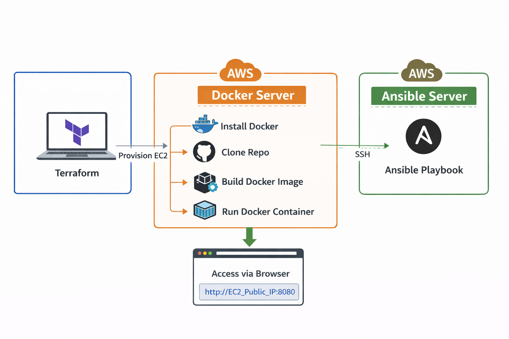
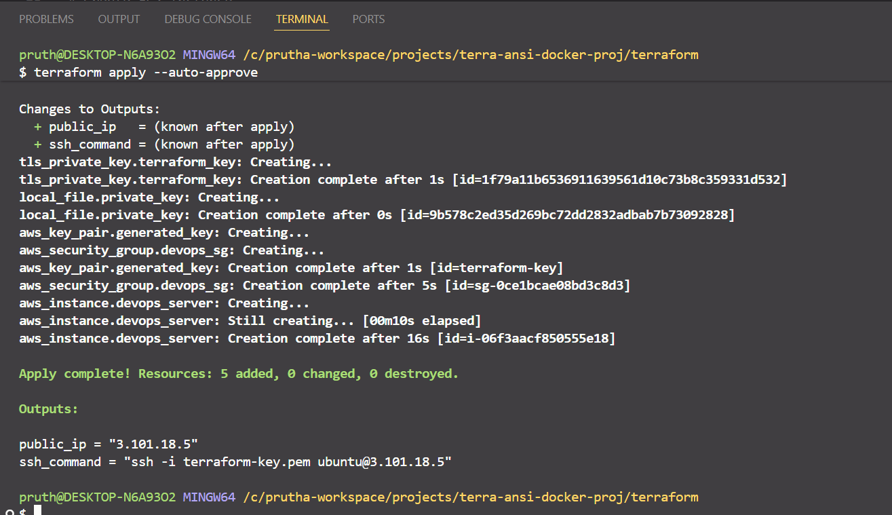
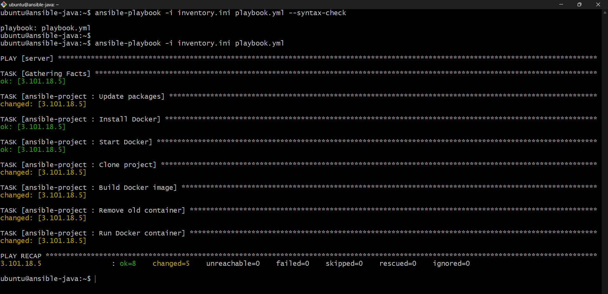
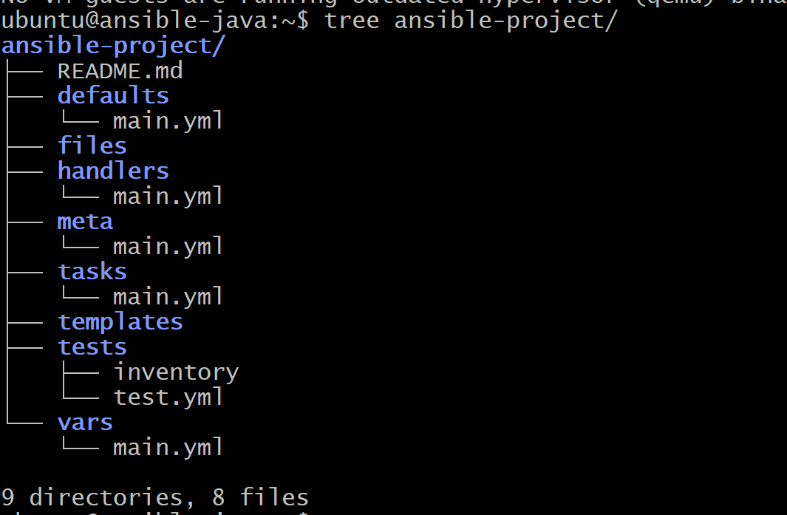
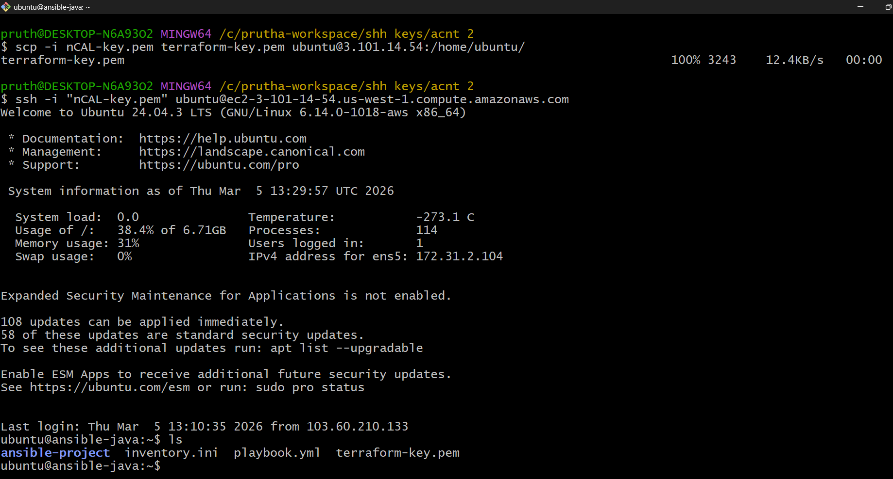
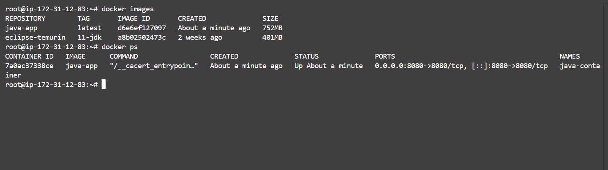
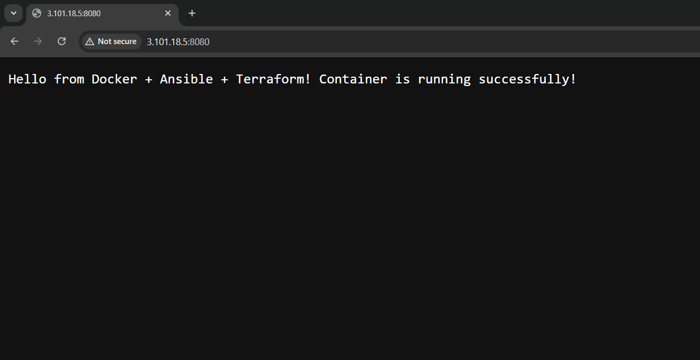

# End-to-End Docker Automation using Terraform & Ansible for Java Maven Application

This project demonstrates a **complete DevOps automation workflow** where infrastructure is created using **Terraform**, the server is configured using **Ansible**, and a **Java Maven application is deployed inside a Docker container**.

The goal of this project is to show how different DevOps tools work together to automatically deploy an application on **AWS EC2**.

Once everything is deployed, the application can be accessed from the browser using:

http://EC2_PUBLIC_IP:8080

---

# What This Project Does

This project automates the entire deployment process.

Instead of manually creating servers and installing software, everything happens automatically.

The workflow is:

1. Terraform creates the AWS infrastructure.
2. Ansible configures the server.
3. Docker builds and runs the application container.
4. The Java application becomes accessible from the browser.

---

# Tools and Technologies Used

- **AWS EC2** – Cloud server where the application runs
- **Terraform** – Used to create infrastructure automatically
- **Ansible** – Used to configure the server and deploy the application
- **Docker** – Used to containerize and run the Java application
- **Java** – Application programming language
- **Maven** – Build tool used to package the Java application
- **GitHub** – Source code repository

---

# Architecture Diagram



---

# Project Architecture

This project follows a DevOps workflow where infrastructure is created using Terraform and configuration is managed using Ansible. The application is deployed inside a Docker container running on an AWS EC2 instance.

```
Developer Machine
        │
        │ Terraform
        ▼
AWS EC2 Instance Created
(Docker Server)
        │
        │ SSH
        ▼
Ansible Server
        │
        │ Ansible Playbook
        ▼
Configure Docker Server
        │
Install Docker
Clone GitHub Repository
Build Docker Image
Run Docker Container
        │
        ▼
Java Application Running
        │
        ▼
Accessible via Browser
http://EC2_PUBLIC_IP:8080
```

### Explanation

1. **Terraform** provisions an AWS EC2 instance which acts as the **Docker server**.

2. An **Ansible server** runs the Ansible playbook.

3. The **Ansible server connects to the Docker server using SSH**.

4. The playbook performs the following tasks:
   - Installs Docker
   - Clones the GitHub repository
   - Builds the Docker image
   - Runs the Docker container

5. The **Java Maven application runs inside the Docker container**.

6. The application becomes accessible from the browser using:

```
http://EC2_PUBLIC_IP:8080
```

---

# Step 1: Create Infrastructure using Terraform

Terraform is used to automatically create the required cloud resources.

In this project, Terraform creates:

- One **AWS EC2 instance** that will act as the **Docker server**
- A **Security Group** to allow SSH and application access
- An **SSH key pair** for secure login

Run the following commands:

```bash
terraform init
terraform apply --auto-approve
```

After execution, Terraform will display the **public IP of the EC2 instance**.

Example output:

```
public_ip = "3.101.18.5"
ssh_command = "ssh -i terraform-key.pem ubuntu@3.101.18.5"
```



---

# Step 2: Configure the Server using Ansible

Ansible is used to configure the EC2 instance created by Terraform.

The Ansible playbook runs **from the local machine** and connects to the EC2 instance via SSH.

The playbook performs the following tasks automatically:

- Update system packages
- Install Docker
- Start the Docker service
- Clone the GitHub repository
- Build the Docker image
- Run the Docker container

Run the playbook:

```bash
ansible-playbook -i inventory.ini playbook.yml
```

Example output:

```
PLAY RECAP
3.101.18.5 : ok=8 changed=5 unreachable=0 failed=0
```

This means the configuration and deployment were successful.



### Ansible Role Structure

In this project, an Ansible role was created using ansible-galaxy to organize automation tasks in a modular and maintainable way.
Command used:
```
ansible-galaxy init ansible-project
```



### Secure SSH Setup

To allow the Ansible server to connect to the Docker server, the Terraform-generated SSH key is copied to the Ansible server.

Example command:
```
scp -i nCAL-key.pem terraform-key.pem ubuntu@3.101.14.54:/home/ubuntu/
```



---

# Step 3: Verify the Docker Container

After the Ansible playbook finishes, the Docker container should be running.

Check running containers:

```bash
docker ps
```

Example output:

```
CONTAINER ID   IMAGE      STATUS
7a0ac37338ce   java-app   Up
```




---

# Step 4: Access the Application

Once the container is running, the application can be accessed from the browser.

Open:

```
http://EC2_PUBLIC_IP:8080
```

Example:

```
http://3.101.18.5:8080
```

You should see the message:

```
Hello from Docker + Ansible + Terraform! Container is running successfully!
```




---

# Project Folder Structure

```
terraform/
│
├── main.tf
├── variables.tf
├── terraform.tfvars
└── outputs.tf

ansible/
│
├── inventory.ini
├── playbook.yml
└── ansible-project/
    ├── tasks/main.yml
    ├── handlers/main.yml
    ├── vars/main.yml
    └── defaults/main.yml

java-docker-app/
│
├── Dockerfile
├── pom.xml
└── App.java
```

---


# Key Things Learned from This Project

This project demonstrates important DevOps concepts such as:

- Infrastructure as Code using Terraform
- Automated server configuration using Ansible
- Application containerization using Docker
- Automated deployment workflow
- Integration of multiple DevOps tools

---

# Troubleshooting

## Docker Container Exits Immediately

Check container status:

```bash
docker ps -a
```

View container logs:

```bash
docker logs <container_id>
```

---

## Maven Build Error

Example error:

```
Malformed POM: expected START_TAG or END_TAG
```

Solution:

Check the XML syntax in the `pom.xml` file.

---

## Main Class Not Found

Example error:

```
Could not find or load main class com.example.App
```

Cause:

Incorrect Java file structure for Maven.

Solution implemented in Dockerfile:

```dockerfile
RUN mkdir -p src/main/java/com/example && \
    mv App.java src/main/java/com/example/
```

---

## Docker Permission Error

Example error:

```
permission denied while trying to connect to the Docker daemon socket
```

Solution:

```bash
sudo usermod -aG docker ubuntu
```

Logout and login again.

---

## Port 8080 Not Accessible

Browser error:

```
ERR_CONNECTION_REFUSED
```

Solution:

Make sure port **8080** is open in the AWS security group.

---

# Useful Debug Commands

```bash
docker ps
docker ps -a
docker logs <container_id>
docker images
docker inspect <container_id>
```

---

# Future Improvements

Possible improvements for this project:

- Add CI/CD pipeline using GitHub Actions
- Add monitoring using Prometheus and Grafana
- Deploy application using Kubernetes

---

# Summary
```
Terraform → creates **Docker server**  
Ansible server → **SSH into Docker server**  
Docker → **runs Java container**  
Browser → **access application**
```

---

# Author

**Prutha Dongre**

DevOps | Cloud | AWS | Docker | Terraform | Ansible

GitHub  
https://github.com/Prutha-Dongre

Linkdin
https://www.linkedin.com/in/prutha-dongre-31a61725a/

Portfolio
https://www.buildwithprutha.cloud/

---